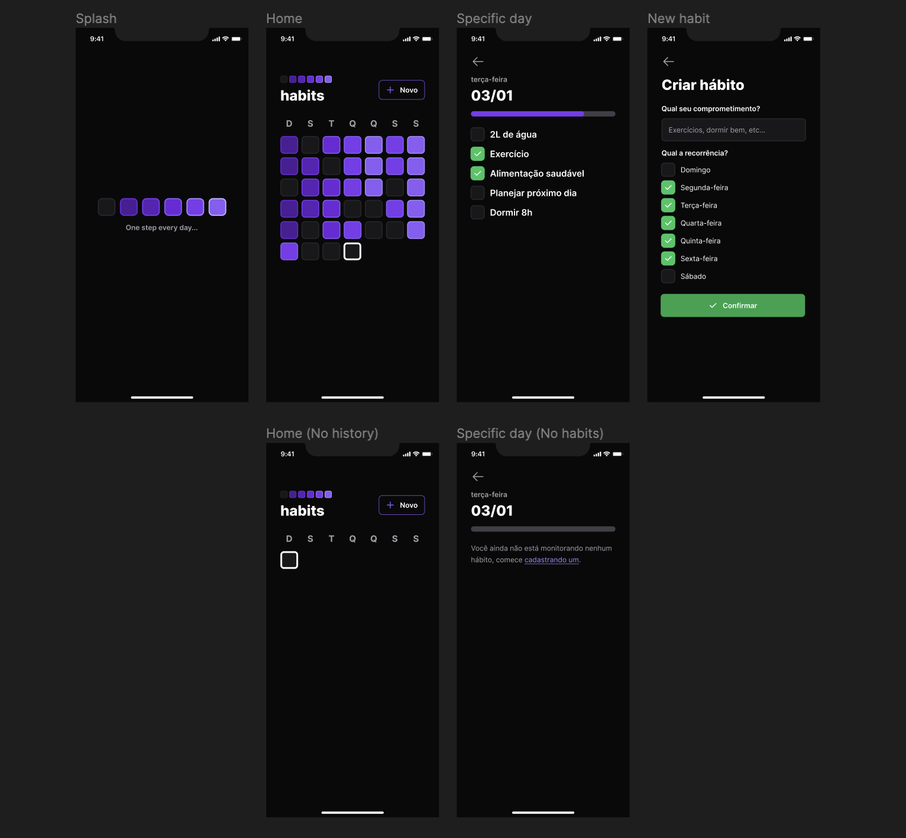
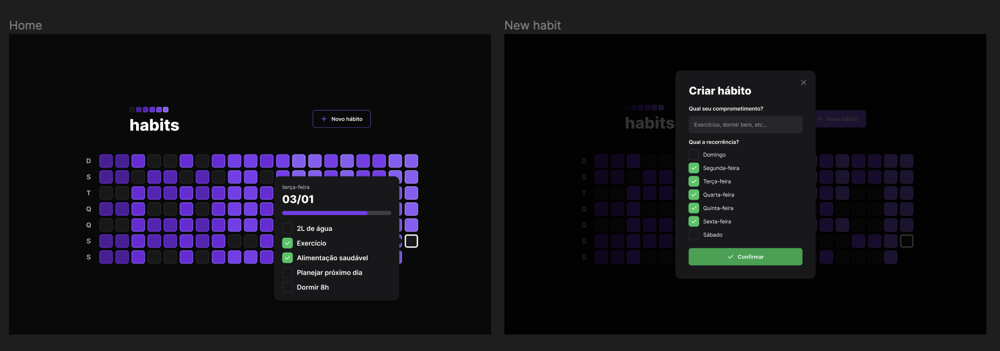

# setup
Aplicação FullStack (back, front e mobile) para acompanhamento de hábitos para o usuário colocar em prática suas resoluções e metas, ou seja, registrar ações e acompanhar a evolução dos novos hábitos que deseja colocar na sua rotina.

Tecnologias utilizadas:

-   [x] Node;
-   [x] React Native;
-   [x] Expo;
-   [x] TypeScript;
-   [x] Prisma;
-   [x] Axios;
-   [x] Vite;
-   [x] Tailwind;
-   [x] Fastify;